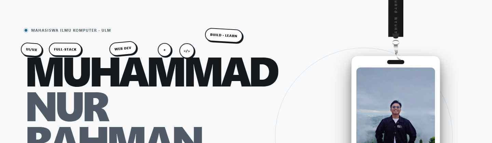
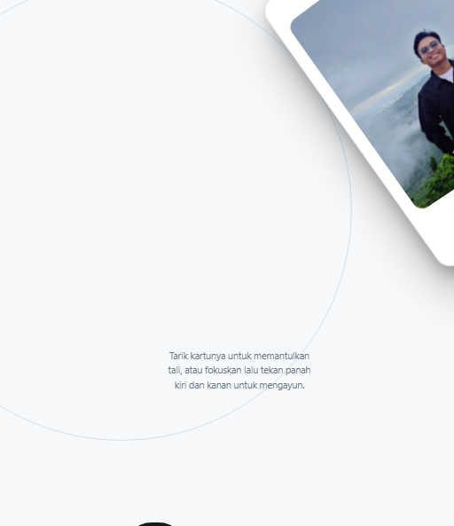
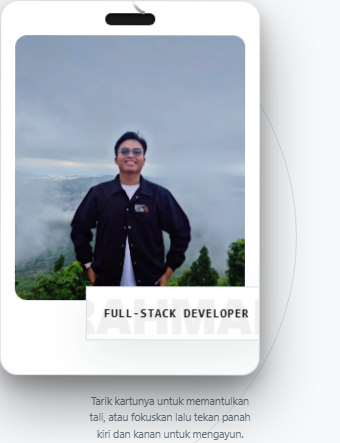
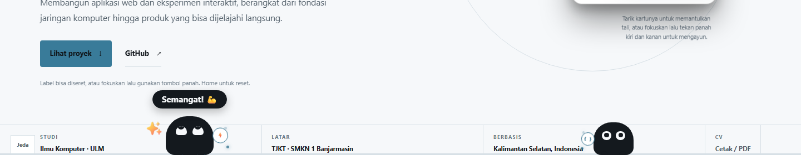
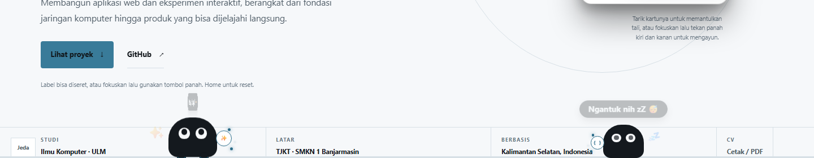
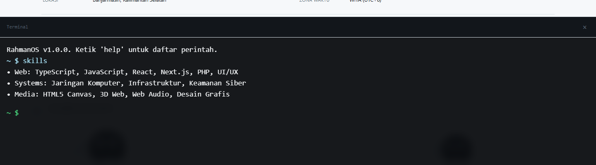
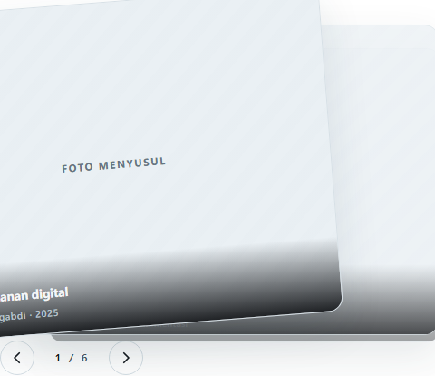
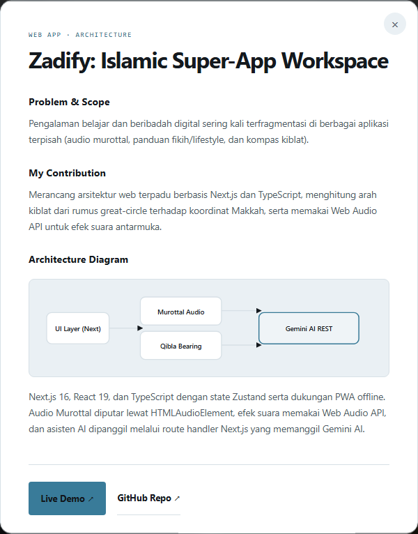

<div align="center">

<!-- Quick Interactive Navigation Bar -->
<p align="center">
  <a href="#-overview"><b>[ 🏠 Overview ]</b></a> &nbsp;•&nbsp;
  <a href="#-features"><b>[ ⚡ Features ]</b></a> &nbsp;•&nbsp;
  <a href="#-shortcuts"><b>[ 🕹️ Controls ]</b></a> &nbsp;•&nbsp;
  <a href="#-projects"><b>[ 🚀 Projects ]</b></a> &nbsp;•&nbsp;
  <a href="#-architecture"><b>[ 🛠️ Architecture ]</b></a> &nbsp;•&nbsp;
  <a href="#-testing"><b>[ 🧪 Testing ]</b></a>
</p>

<br/>

# ⚡ MUHAMMAD NUR RAHMAN · PORTO 3.0

> **Mahasiswa S1 Ilmu Komputer ULM & Full-stack Developer**  
> Eksperimen web interaktif performa tinggi dengan *Custom 2D Physics Engine*, *3D Polar Pendulum Dynamics*, *Autonomous Mascot System*, dan *Zero Framework Overhead*.

<p align="center">
  <a href="https://rahmannch.github.io/porto3.0/"></a>
  &nbsp;
  <a href="scripts/smoke.spec.js"></a>
  &nbsp;
  <a href="#aksesibilitas"></a>
  &nbsp;
  <a href="LICENSE"></a>
</p>

</div>

<br/>

<span id="-shortcuts"></span>
## 🕹️ Jalan Pintas Kontrol Cepat (Keyboard & Gestures)

| Aksi | Masukan / Shortcut | Hasil Interaksi Sistem |
| :--- | :--- | :--- |
| **Buka Terminal CLI** | Tekan <kbd>`</kbd> (Backtick) | Mengangkat laci terminal pengembang *RahmanOS v1.0* |
| **Reset Posisi Stiker** | Tekan <kbd>Home</kbd> | Membekukan fisika & meratakan stiker ke alas nama "MUHAMMAD" |
| **Ayunan Kartu ID 3D** | Tekan <kbd>←</kbd> / <kbd>→</kbd> | Mengayunkan tali kartu dengan momentum aerodinamika 3D |
| **Tarik Kartu ID** | Tekan <kbd>↑</kbd> / <kbd>↓</kbd> | Menarik & meregangkan tali webbing elastis |
| **Navigasi Galeri** | Tekan <kbd>←</kbd> / <kbd>→</kbd> di galeri | Membalik tumpukan kartu dokumentasi kegiatan |
| **Lempar Stiker** | Tarik & Lepas (*Mouse Drag & Toss*) | Melempar stiker dengan kecepatan vektor lemparan (*toss velocity*) |

---

<span id="-features"></span>
## 🌟 Sorotan Fitur Interaktif & Galeri Visual

<details open>
<summary><h3>1. 📦 Letter-Terrain Gravity Physics (Stiker Hero)</h3></summary>
<br/>

Mesin simulasi fisika benda tegar 2D (*Rigid-Body Solver*) kustom tanpa library eksternal. Menggunakan batas atas teks raksasa **"MUHAMMAD"** sebagai medan kontur fisik (*topographical terrain*) dengan puncak dan lembah huruf.

<div align="center">
  
</div>

* **Karakter Pantulan Balok:** Restitusi padat ($e = 0.24$), bukan bola karet liar.
* **Tumbukan Antar-Objek:** Deteksi tabrakan elips AABB dengan transfer momentum elastis murni ($e = 0.30$) sehingga stiker berhamburan alami.
* **Lempar Bebas (Inertia Toss):** Melacak vektor pergeseran $\Delta x / \Delta t$ kursor saat ditarik. Melepaskan kursor akan melempar stiker mengikuti momentum lemparan.
* **Auto-Sleep Engine:** Begitu semua kecepatan $|v| < 0.6\text{ px/s}$, loop animasi berhenti (*0% CPU usage*).
* **Responsive Guard:** Menyetel ulang posisi ke nol otomatis saat jendela browser mengecil ke mode mobile ($\le 720\text{px}$).

```bash
# Model Kontur Medan Huruf:
# M     U     H     A     M     M     A     D
# /\/\  |__|  |__|   /\   /\/\  /\/\   /\   |--\  (Puncak & Lembah Huruf)
```
</details>

<br/>

<details open>
<summary><h3>2. 💳 3D Polar Pendulum Lanyard & Premium Shark Pin</h3></summary>
<br/>

Simulasi kartu identitas gantung dengan dinamika fisika polar teredam dua derajat kebebasan dan proyeksi rotasi 3D.

<table width="100%">
  <tr>
    <td width="50%" align="center">
      <b>Ayunan Aerodinamis 3D</b><br/><br/>
      
    </td>
    <td width="50%" align="center">
      <b>Aksen Enamel Pin Hiu</b><br/><br/>
      
    </td>
  </tr>
</table>

* **Fisika Tali Elastis:** Menyelesaikan persamaan gerak pendulum polar:
  $$\ddot{r} = r\dot{\theta}^2 + g\cos\theta - k(r - r_0) - c_r\dot{r}$$
  $$\ddot{\theta} = -\frac{g}{r}\sin\theta - c_t\dot{\theta} - 2\frac{\dot{r}}{r}\dot{\theta}$$
* **Orientasi Aerodinamis 3D:** Sudut ayunan diproyeksikan langsung ke sumbu `--rot-y` dan `--rot-x` menggunakan CSS 3D Transforms (`transform-style: preserve-3d; perspective: 1200px`).
* **Pin Hiu Logam Enamel:** Lencana hiu metalik premium terpasang di atas klip lanyard dengan kilau enamel dan bayangan tebal.
* **Mobile Guard:** Tali lanyard otomatis disembunyikan pada layar sempit ($\le 720\text{px}$) agar tidak menutupi teks.
</details>

<br/>

<details open>
<summary><h3>3. 👾 Dual Organic Mascot Ecosystem</h3></summary>
<br/>

Dua karakter maskot cerdas yang berkeliaran di lantai platform dengan perilaku otonom, pelacakan tatapan mata, dan dialog responsif.

<table width="100%">
  <tr>
    <td width="50%" align="center">
      <b>Mode Gelap (Tubuh Putih)</b><br/><br/>
      
    </td>
    <td width="50%" align="center">
      <b>Mode Terang (Tubuh Hitam)</b><br/><br/>
      
    </td>
  </tr>
</table>

* **Adaptasi Tema Murni:** Tubuh maskot otomatis putih di *Dark Mode* dan hitam di *Light Mode* via token `--ink`.
* **Sepatu Kartun & Smart Footing:** Kaki dilengkapi garis tepi tegas dan sol biru aksen; animasi langkah otomatis diam saat maskot berhenti/berbicara.
* **Separasi Visual Spasial:**
  * **Atas:** Balon kata dialog bersih tanpa emoji agar mudah dibaca.
  * **Sisi Kiri:** Aura identitas ambien (`</>` / `{ }`) dan partikel melayang konstan.
  * **Sisi Kanan:** Lencana reaksi emosional (`👋` melambai saat sapaan, `💦` memantul saat kaget, `💤` saat tidur).
* **Interaksi Tatapan Halus:** Pupil melacak kursor secara real-time dengan interpolasi koordinat tanpa terbalik saat tubuh berbalik arah (`scaleX`).
* **Anti-Deadlock Multi-Click:** Pengguna dapat mengeklik kedua maskot bergantian dan keduanya langsung bersuara tanpa antrean macet.
</details>

<br/>

<details>
<summary><h3>4. 💻 RahmanOS Developer CLI Drawer</h3></summary>
<br/>

Terminal konsol pengembang terintegrasi yang dapat dibuka melalui tombol footer atau menekan tombol <kbd>`</kbd>.

<div align="center">
  
</div>

```
~ $ help
Perintah: whoami, projects, skills, theme [dark|light|toggle], contact, print, pet, clear, exit
```

- [x] **Kontrol Tema Instan:** `theme light` / `theme dark` mengganti tema website secara mulus.
- [x] **Riwayat Perintah (History):** Tekan <kbd>↑</kbd> dan <kbd>↓</kbd> untuk menelusuri perintah sebelumnya.
- [x] **Aksi Terintegrasi:** Mengetik `print` langsung memicu dialog cetak CV, mengetik `pet` langsung menyapa maskot.
</details>

<br/>

<details>
<summary><h3>5. 🗂️ Stacked Activity Deck Gallery & Case Study Modal</h3></summary>
<br/>

Galeri dokumentasi kegiatan berbentuk tumpukan kartu interaktif (*flashcard deck*) dan modal arsitektur interaktif.

<table width="100%">
  <tr>
    <td width="50%" align="center">
      <b>Tumpukan Galeri Bergeser</b><br/><br/>
      
    </td>
    <td width="50%" align="center">
      <b>Modal Arsitektur & Denyut Node</b><br/><br/>
      
    </td>
  </tr>
</table>

* **Swipe Gesture & Keyboard:** Geser kartu ke kanan/kiri via pointer drag atau tombol panah keyboard.
* **Backlog Queue Limiter:** Membatasi tumpukan antrean aksi agar transisi kartu tidak melompat liar saat tombol ditekan berulang kali.
* **Diagram Denyut SVG:** Node aktif di dalam studi kasus proyek berdenyut halus (`node-pulse`) mempertegas arsitektur data.
</details>

---

<span id="-projects"></span>
## 🚀 Featured Projects

<table width="100%">
  <!-- Project 1: Zadify -->
  <tr>
    <td colspan="2" valign="top">
      <div align="center">
        <h3>🕋 Zadify — The Islamic Super-App Workspace</h3>
        <p>Comprehensive Quranic workspace featuring real-time Web Audio Murottal, Gemini AI Mentor, and 3D Qibla Compass.</p>
        <p>
          
          
          
          
        </p>
        <a href="https://zadify.vercel.app" target="_blank">
          
        </a>
        &nbsp;
        <a href="https://github.com/RahmannCH/Zadify" target="_blank">
          
        </a>
      </div>
      <br/>
    </td>
  </tr>

  <!-- Project 2 & 3: CodeChrome & Game-Farm -->
  <tr>
    <td width="50%" valign="top">
      <div align="center">
        <h3>⌨️ CodeChrome</h3>
        <p>Keyboard-first browser dashboard with synthesized mechanical switch sound effects & live AI streaming.</p>
        <p>
          
          
          
        </p>
        <a href="https://github.com/RahmannCH/CodeChrome" target="_blank">
          
        </a>
      </div>
    </td>
    <td width="50%" valign="top">
      <div align="center">
        <h3>🚜 Game-Farm-2.0</h3>
        <p>2D agricultural simulator built entirely on native HTML5 Canvas 2D without external game engines.</p>
        <p>
          
          
          
        </p>
        <a href="https://game-farm-2-0.vercel.app" target="_blank">
          
        </a>
        &nbsp;
        <a href="https://github.com/RahmannCH/Game-Farm-2.0" target="_blank">
          
        </a>
      </div>
    </td>
  </tr>

  <!-- Project 4: VirtualPet DFA -->
  <tr>
    <td colspan="2" valign="top">
      <div align="center">
        <h3>🦈 VirtualPet TeKom (5-Tuple DFA Automata)</h3>
        <p>Interactive college simulation system mathematically modeled with a Deterministic Finite Automaton $(Q, \Sigma, \delta, q_0, F)$.</p>
        <p>
          
          
          
        </p>
        <a href="https://virtual-pet-tekom.vercel.app" target="_blank">
          
        </a>
        &nbsp;
        <a href="https://github.com/RahmannCH/VirtualPet_TeKom" target="_blank">
          
        </a>
      </div>
    </td>
  </tr>
</table>

---

<span id="-architecture"></span>
## 🛠️ Arsitektur Teknis

```
porto3.0/
├── index.html            # Markup semantik & kepatuhan aksesibilitas WCAG 2.2 AA
├── css/
│   ├── style.css         # Desain sistem token editorial, tipografi fluid clamp, & CLI drawer
│   ├── portfolio.css     # Komponen: Lanyard 3D, Maskot Organik, Galeri Tumpuk, Stiker Fisika
│   ├── scrollcraft.css   # ScrollCraft progress bar & engine style
│   └── print.css         # Lembar gaya cetak resmi dokumen CV (media="print")
├── js/
│   ├── main.js           # Engine fisika stiker, state machine maskot, CLI, & interaksi
│   └── scrollcraft.js    # Engine scroll interaktif
├── assets/               # Pratinjau proyek asli & pin hiu enamel SVG
│   └── readme/           # Tangkapan layar resolusi tinggi dokumentasi interaktif
└── scripts/
    ├── serve.mjs         # Server pengembangan lokal statis
    └── smoke.spec.js     # 34 pengujian otomatis Playwright menyeluruh
```

---

<span id="-testing"></span>
## 🧪 Instalasi & Pengujian

### Prasyarat
* [Node.js](https://nodejs.org/) v18 atau yang lebih baru.

```bash
# 1. Kloning Repositori
git clone https://github.com/RahmannCH/porto3.0.git
cd porto3.0

# 2. Pasang dependensi & jalankan server lokal
npm install
npm run dev
# Buka peramban pada http://127.0.0.1:48123

# 3. Eksekusi 34 pengujian otomatis Playwright menyeluruh
npm run test:e2e
```

---

<div align="center">

Dirancang dan dibangun dengan rasa ingin tahu oleh **[Muhammad Nur Rahman](https://github.com/RahmannCH)**  
© 2026 Hak Cipta Dilindungi.

</div>
